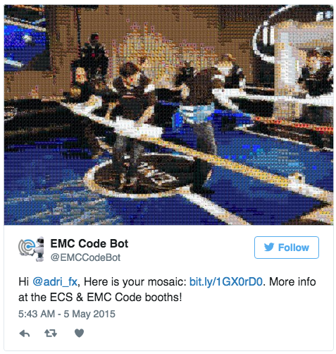

# MosaicMe

## Introduction

Mosaicme is a [Microservice](http://en.wikipedia.org/wiki/Microservices "Microservices") application that retrieves images from selected Twitter feeds, stores them on an [object store](http://en.wikipedia.org/wiki/Object_storage "Object Store"), and then it process them to build a mosaic based on a selected set of pictures.

The MosaicMe application is a demo application to showcase how to design, build, and deploy a microservices application. We have followed the best practices shared by the [12 Factor App](http://12factor.net/) manifest and  DevOps best practices to showcase how to do Continuous Integration (CI) and Continuous Deployment (CD) to automate the deployment of the application.

## How does it work?

MosaicMe is composed of multiple tiers. The following figure is a high level diagram with the data flow when a new mosaic is requested.

The whole process is triggered by a user sending a tweet with the hashtag #mosaicme and a picture like the following one.

Right after, the **Listener** service, which is connected to the **Twitter Streaming API** and listening to the `#mosaicme` feed, receives the tweet and obtains  information about the requester (name and Twitter handler) and the image URL. Then, this information is passed to the **Engine** service via messaging queues.

An **Engine** worker takes over and downloads the image and builds the mosaic using [Metapixel](https://www.complang.tuwien.ac.at/schani/metapixel/). After a few minutes, once the mosaic is done, the Engine uploads the image to the object store (Swift, S3), attaching the requester information as object metadata. Afterwards, it notifies the **Publisher** and **Cacher** services.

The **Publisher** service sends a tweet mentioning the user that requested the mosaic with the mosaic thumbnail attached and a link to the MosaicMe website to see the full-resolution mosaic.

The **Cacher** service, on the other hand, updates the cache (Redis) with the latest mosaic metadata.

Finally, when the user checks the tweet and clicks on the link, it is redirected to the MosaicMe **Website**. The website obtains the mosaics metadata from the cache and the user browser downloads the mosaics directly from the object store.

## How can I run it?

Check out the [Deployment Guide](DEPLOYMENT.md) for information about deploying MosaicMe using the Docker images available.

## Contributing

Did you found a bug or got an idea for a new feature? Feel free to use the [issue tracker](https://github.com/emccode/mosaicme/issues) to let us know. Or make directly a [pull request](https://github.com/emccode/mosaicme/pulls).

## Licensing

MosaicMe is licensed under the [MIT](http://opensource.org/licenses/MIT "The MIT License (MIT)") license. Check out the [LICENSE](https://github.com/emccode/mosaicme/blob/master/LICENSE) file for the latest licensing information.

## Support

If you have questions relating to the project, please either post [GitHub Issues](https://github.com/emccode/mesos-module-dvdi/issues), join our Slack channel available by signup through [community.emc.com](https://community.emccode.com) and post questions into `#mosaicme`, or reach out to the maintainers directly.  The code and documentation are released with no warranties or SLAs and are intended to be supported through a community driven process.
